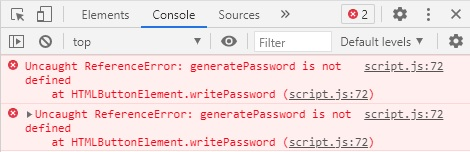
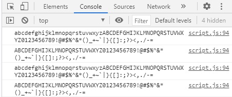

# Password Generator
Using javascript to create a password generator

---
## Author

Shawn Fox

| [GitHub](https://github.com/SFoxGit) | [Email](sfoxss4@gmail.com) |

---
## Project Links:

- Deployed site: [GitHub Pages](https://sfoxgit.github.io/password_generator/)
- GitHub: [SFoxGit](https://github.com/SFoxGit/password_generator)

---
## Table of Contents

- [Description](##Description)

- [Requirements](##Requirements)

- [Progress](##Progress)

- [Contributions](##Contributing)

- [Credits](##Credits)

---
## Description

Password generator using javascript that can create different levels of security based on user preference. 

---
## Requirements

    GIVEN I need a new, secure password
    WHEN I click the button to generate a password
    THEN I am presented with a series of prompts for password criteria
    WHEN prompted for password criteria
    THEN I select which criteria to include in the password
    WHEN prompted for the length of the password
    THEN I choose a length of at least 8 characters and no more than 128 characters
    WHEN prompted for character types to include in the password
    THEN I choose lowercase, uppercase, numeric, and/or special characters
    WHEN I answer each prompt
    THEN my input should be validated and at least one character type should be selected
    WHEN all prompts are answered
    THEN a password is generated that matches the selected criteria
    WHEN the password is generated
    THEN the password is either displayed in an alert or written to the page

---
### Must include:

    Application user experience is intuitive and easy to navigate.
    Application user interface style is clean and polished.
    Application resembles the mock-up functionality provided in the homework instructions.
    

---
## Progress

Stage One: 

*Understanding the instructions.* 

    I've read over them many times now, there are some very specific requirements that target what we learned this week. First step variables, I think we'll mostly use strings and then split to arrays and booleans for prompts. Use .length and math.random, they probably want us to use toUpperCase instead of creating two strings of uper and lower to display we know how. I don't believe we need to make changes to the html or css to make it properly function but time will tell. I may have over looked validation, good thing I just read it again, should be if false false false reprompt I think.

Stage Two:

*Creating variables and prompts.* 

    I'm not sure if I actually need the booleans for the prompts, I think I got over zealous with the vars. I'll change them multiple times fret not.
    I'm now opting to make a new array of Y and N instead of doing booleans after looking back at how I did this in the class activity of rock paper scissors. however, I'm pretty sure booleans could have worked just fine.
    After writing the prompts, I wanted to test them.

    Which on the js line 72 is the generatePassword function which doesn't exist yet. Will try commenting it out.
    Commenting out removed the error, but I didn't have an eventListener to start the functions haha. Easy fix and the prompts work!

Stage Three:

*Validation and generation*

    At this point our length should be between 8 and 128, and all 4 character types should be Y or N. Now we need to validate that all 4 are not N. Create our array by spliting the current strings and combining them into one large array for the gen to pull from, and not forget that we need to create the var upperCase from the lowerCase with toUpperCase!

    Validation test was a success! Just a simple if && for N in each character. This is where it gets difficult. First we need to create the new array based on the prompts. Tested with a simple console.log(passwordTable)

    This is going too smoothly. Onward to generation! My thought is we can just math.random loop it for the lengthP (length prompt) but if we had 8 length and all prompts selected each char has a 10/91 chance of being a number, which is lowested odds, but if we miss 8 times the password has no number. 

    I was going to split the string into an array and then return it to a string, then I remembered charAt is a thing. Had a heck of a time with the generatePassword function, countless small errors. I now need to reset it back to blank after process completes because it just keeps adding to the previous generated password currently. Easy fix, moved password = "" to the start of the very first function. Functionality is complete. This could be condensed down into far fewer functions but this is very easy to read like this, so better educationally I think.

Stage four:

*Going back over*

    I believe I do have to validate that all char types are being used. Back into the javascript to do that. I think splitting the string into an array for not only the password but also the character types as well, then doing a comparison *should* do the trick. 

    Many hours later, I created infinite loops that broke password table. I think the fix is changing to do whiles then having it change the while condition var. Unfortunately I am out of time but I am so close. I'm going to leave the progress commented out and come back to it.

    

---
## Contributing

---
## Credits

Original code provided by: UNC Charlotte BootcampSpot

